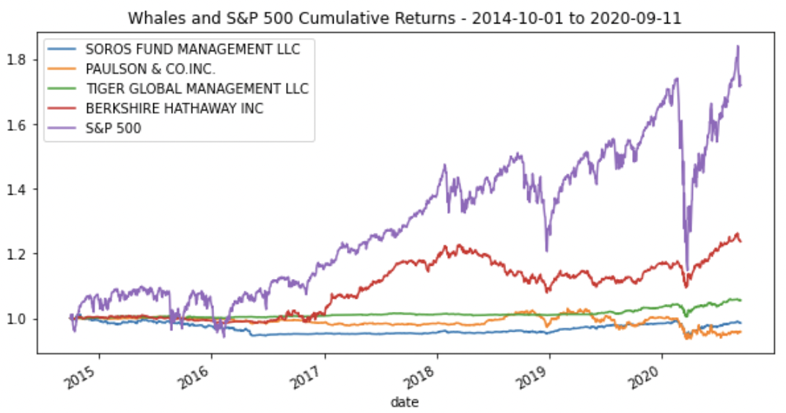
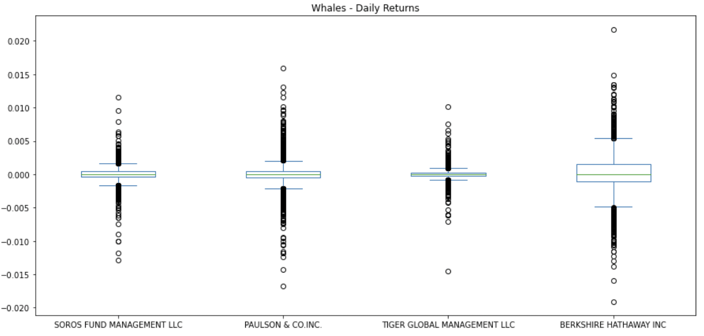
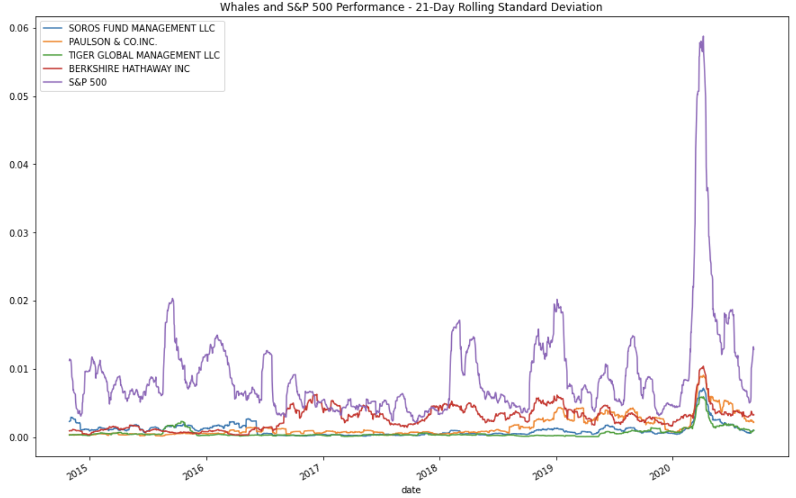
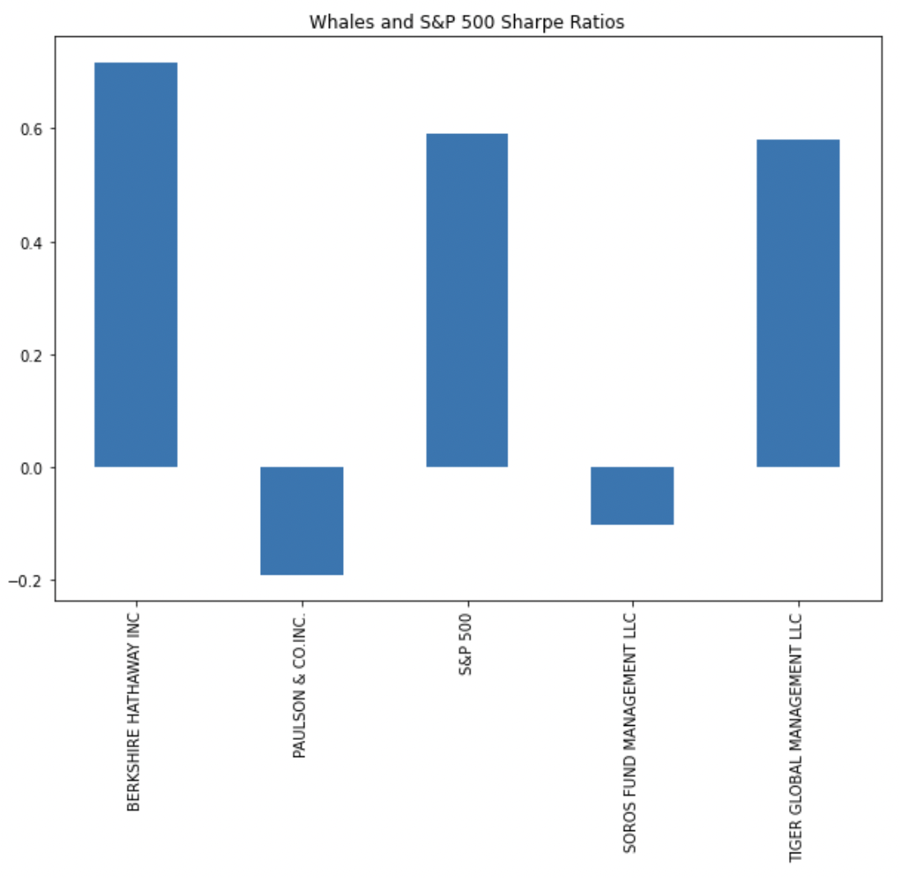

# 04_Portfolio_Analysis

### This is an investment analysis for clients who wish to have a one-stop investment solution to build a retirement portfolio that's both inexpensive and high quality. Specifically, this is a quantitative analysis on historical data (2015-2020) of the whales (Soros Fund Management LLC, Tiger Global Management LLC, Berkshire Hathaway Inc, and Paulson & Co. Inc) portfolios' performance, volatility, risk, and risk-return profile to create a diverse portfolio for the client.

---

## Technologies

This project leverages python 3.9 and Jupyter lab notebook was used to run all analysis.

---

## Installation Guide

Before running the application first import the following libraries and dependencies.

```python
import pandas as pd
import numpy as np
from pathlib import Path

%matplotlib inline
```

---

## Import and prepare the data

Using the Pandas `read_csv` function and the `Path` module, the Whales database was imported and then created into dataframes. The DatetimeIndex was set as the Timestamp column and the dates were parsed and formatted in order to convert the dataframes into daily returns by using the `pct_change` and `dropna` functions.

---

## Performance and Volatility Analysis

In this initial analysis, daily returns data from 2015-2020 of the whales portfolios and S&P 500 were analysed to determine if any of the portfolios outperformed the broader stock market, which is the S&P 500. This was done by calculating and plotting the cumulative returns (using `cumprod()`) of the 4 fund portfolios and S&P 500.

Image below displays that none of the four fund portfolios have outformed the market during the timeframe but Berkshire Hathaway and Tiger Global Management seem to demonstrate higher returns than the others.



In the following image, you can see that Berkshire Hathaway displays the most volatility with the greatest spread and Soros Fund Management having the smallest.



---

## Risk and Risk-Return Analysis

When evaluating the risk profile of each portfolio, the standard deviation and the beta values were calculated.

To look at it in more depth, the annualized standard deviations were calculated and plotted with a 21-day rolling window.

Below are the main calculations to find the standard deviations and then were sorted from smallest to largest.

```python
whales_daily_returns_std = whales_daily_returns.std()
whales_daily_returns_std_sorted = whales_daily_returns_std.sort_values()
```

Below are the main calculations to find the annualized standard deviations and then sorted them from smallest to largest. 252 represents the number of trading days in a year.

```python
whales_daily_returns_annualized_std = whales_daily_returns_std_sorted * np.sqrt(252)
whales_daily_returns_annualized_std_sorted = whales_daily_returns_annualized_std.sort_values()
```

Below is a summary of the findings:

The 21-Day Rolling Standard Deviations of the portfolios' and the market's were plotted to visualize the results:



- Based on the annualized standard deviations, no portfolios poses more risk than the S&P 500's as it has the hightst annualized SD of 18.33%.

- Based on the rolling metrics, the risk of each portfolio somewhat mirrors that of the S&P 500's. For instance, all but Tiger Global Management showed a spike in risk in 2019 and all of them did in 2020. But the Tiger Global Management portfolio seems to differ the most from all others, including the S&P 500.

- Based on the rolling standard deviations of only the four fund portfolios, Berkshire Hathaway poses the most risk when compared to the others as it had the highest 21-day rolling standard deviations from the end of 2016 to most of 2020. From 2015 towards the end of 2016, it still posed a lot of risk but was similar to that of Soros'.

Then, the overall risk-return profile was analyzed by calculating the Sharpe ratios of each portfolio and S&P 500. This was calculated by finding the annualized average return divided by the annualized standard deviation.

```python
whales_sharpe_ratios = whales_daily_returns_annualized_avg / whales_daily_returns_annualized_std
```

Below is a visualization of the results, which is that Tiger and Berkshire Hathaway offer the best risk-return profile with Sharpe Ratios of 0.58 and 0.72, respectively. The worst ones are Paulso & Co. and Soros Fund Management, which has Sharpe Ratios of -0.19 and -0.10. This means that the risk-free rate is greater than the portfolio's return so the return on the portfolio is expected to be negative.



---

## Portfolio Diversification and Recommendations

Lastly, we needed to evaluate how the portfolios react relative to the broader market. Based on the analysis so far, we have chosen to further analyze Berkshire Hathaway and Tiger Global Management by looking at their beta values.

The beta for each portfolio was calculated by dividing the covariance of each portfolio by the variance of the S&P 500. Below are the plotted results in the timeframe of 2015-2020.


**In conclusion**, Berkshire Hathaway seems more sensitive to the movements in the S&P 500 because it has a higher average Beta value (0.22) than Tiger Global Management's (0.03). This imeans Bershire Hathaway's movements are more correlated to those of the market's.

**Recommendations**: **Berkshire Hathaway** would be the ideal choice as its movements mimics that of the market's and has the highest Sharpe ratio of 0.72, whihc is even higher than that of S&P 500's. I would also recommend **Tiger Global Management** because it does not mirror the market that much so if the market crashes, it does not affect Tiger that much. Paulson and Soros wouldn't be advised because they have negative annualized Sharpe ratios, which means they have not performed well and lost some money.
